# Leaf-disease-classification
This repository contains a deep learning-based image classification project to detect and classify leaf diseases in potato and tomato plants using Convolutional Neural Networks (CNNs) built with PyTorch.

# 📌 Problem Statement
Agriculture plays a vital role in sustaining the global economy and food supply. However, the productivity of crops is significantly impacted by plant diseases, many of which manifest visibly on the leaves. Manual identification of leaf diseases is time-consuming, labor-intensive, and often inaccurate, especially in large-scale farming.

The objective of this project is to develop an automated system for classifying plant leaf diseases using deep learning techniques. The system will be trained on a dataset containing images of healthy and diseased leaves, specially of potato and tomato plants, with multiple classes of diseases. By leveraging Convolutional Neural Networks (CNNs), the model will learn to accurately distinguish between various disease types and healthy leaves.

This solution aims to assist farmers and agricultural experts by providing a fast, scalable, and accurate method to diagnose tomato and potato plant diseases early, thereby improving crop management, reducing losses, and increasing yield.

# 🎯 Goal
  * Preprocess and augment image data to enhance model robustness.
  * Train a CNN to classify leaf images into appropriate disease categories.
  * Evaluate the model using metrics such as accuracy, precision and recall.

# 🖼️ Dataset
The datset that I have used for the project is taken from the Kaggle website (https://www.kaggle.com/datasets/arjuntejaswi/plant-village/data) Well kaggle is a famous website known for organizing many data science competition and for delivering dataset.
 
# 🔍 Exploratory Data Analysis (EDA)

## 📌 Dataset overview and class distribution
This dataset consist of 15 different types of leafs, the total size of the dataset is 20605 outof which 2475 are of pepper bell leafs, 2152 are of potato leafs and 15978 images are of tomato leafs.
  * Pepper__bell___Bacterial_spot -> 997 images.
    

       
    

  * Pepper__bell___healthy -> 1478 images.
    
    
  * 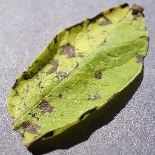
  * 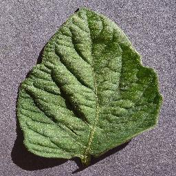
  * 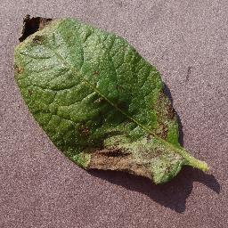
  * 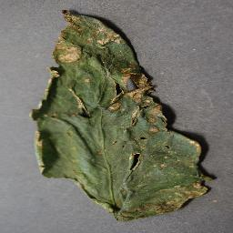
  * 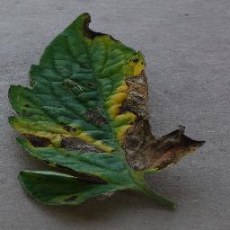
  * 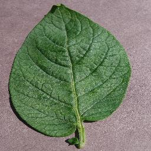
  * 
  * 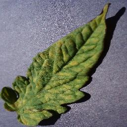
  * 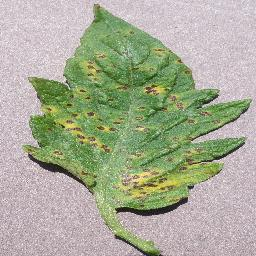
  * 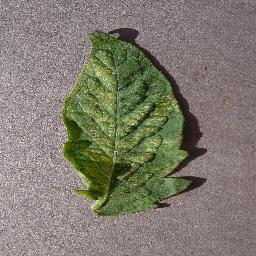
  * 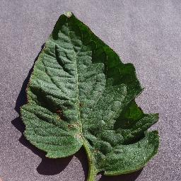
  * 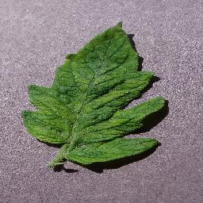
  * 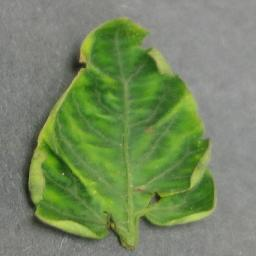
    
